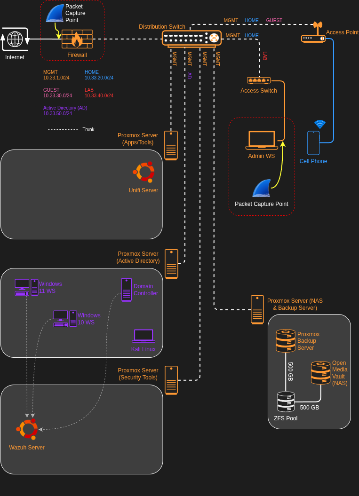
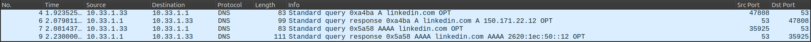
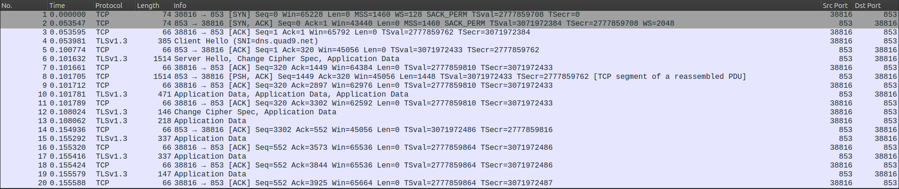

# DNS vs DNS over TLS - Wireshark Analysis

## Scenario

I will be analyzing DNS traffic from my gateway using both standard DNS on port 53 and DNS over TLS (DoT) on port 853. The goal is to see the difference between each protocol and the security benefits of using encrypted DoT over standard DNS at the packet/protocol level.

## Capture Points

## Filters & Approach

| Step | Filter / Feature Used | Why |
|------|----------------------|-----|
| 1 | dns | filters all dns traffic on the endpoint device |
| 2 | (ip.addr eq <src_ip_address> and ip.addr eq <dest_ip_address>) and (udp.port eq <src_port> and udp.port eq 53)  | filters single IPv4 UDP conversation to resolve linkedin.com |
| 3 | (ip.addr eq <src_ip_address> and ip.addr eq <dest_ip_address>) and (tcp.port eq <src_port> and tcp.port eq <dest_port>) | filters  single IPv4 TCP conversation to resolve linkedin.com |

## Key Findings

- **Finding 1:** Endpoint devices use standard, unencrypted DNS to communicate with the local DNS forwarder (OPNsense firewall)

- **Finding 2:** DNS traffic out of WAN is fully in the clear using the standard DNS protocol

- **Finding 3:** The contents of DNS queries is fully encrypted out of WAN using DNS over TLS

## How This Looks in the Real World

Most people use standard, unencrypted DNS protocols for resolving domain names to IP addresses. Everything that is done online is visible to 3rd parties, most notability internet service providers, while using standard DNS.

Implementing encrypted DNS with malware protection provides massive privacy and security benefits at the network level for all clients.

I used a practical approach to learning this tool by inspected and validating my DNS stack at the packet level. Stay tuned for more projects involving Wireshark.